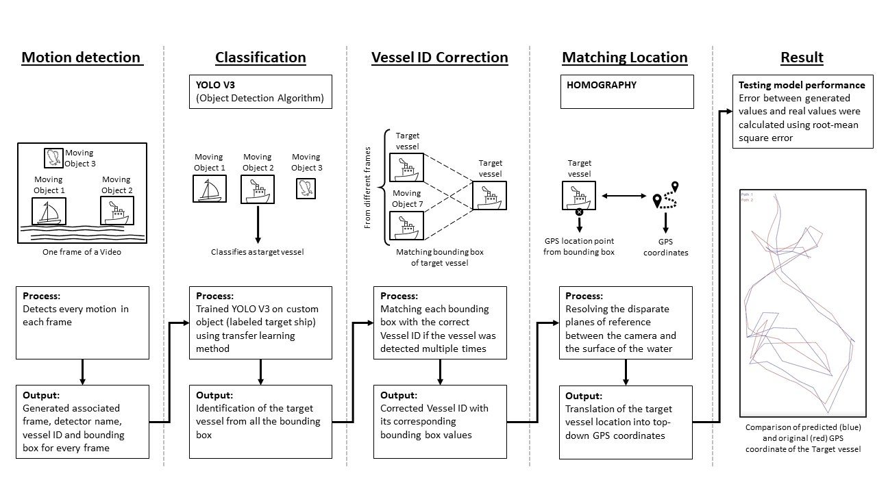

# Morgan State University's AITaS Solution: Seahawk

An ensemble AI-CV system for the "AI Tracks at Sea" Challenge.

## Getting Started

There are 2 ways to run Seahawk

1) Locally via python virtual environment
2) Docker via https://hub.docker.com/r/emichris/seahawk

#### Preparing the ENV

You may skip this step if your developmental environment is already setup

1) Download the repository

```bash
git clone https://github.com/NWalker4483/TrackAtSea.git
```

2) Change into the cloned repository

```bash
cd TrackAtSea
```

3) Create a virtual environment

```bash
python3 -m venv venv
```

4) Update `pip`

```bash
pip install --upgrade pip
```

5) Install requirement

```bash
pip install -r requirements.txt
pip install https://storage.googleapis.com/tensorflow/mac/cpu/tensorflow-1.12.0-py3-none-any.whl
```

> **ALTERNATIVELY**, you can run `getting-started.sh` in order to automatically set up your python environment.

```bash
bash ./getting-started.sh
```

#### Running the Seahawk

Since `tools.py` has default arguments, simply running is the command below in your terminal sufficient to run *Seahawk*

```bash
python tool.py
```

For more help run 

```bash
python tool.py --help
```

## Introduction

To avoid collisions between vehicles and crafts, current traffic avoidance systems depend on older technologies such as RADAR and automatic identification systems (AIS). To improve unmanned surface vehicles’ (USVs’) capacity to detect and track maritime traffic, computer vision systems can offer a wide range of possibilities that are not bound by the constraints of the current RF system.

In response to the AI Tracks at Sea (AITaS) challenge, the team at Morgan State University, the Morgan Bears, are proposing “Seahawk”: an ensemble system consisting of artificial intelligence (AI) and computer vision (CV) techniques. This white paper describes the core concepts, the methodology of the system design and implementation, and the early result of this novel application of AI/ML infused CV systems to improve maritime detection and tracking.

## System Architecture

As mentioned previously, and shown in Figure 1, the Seahawk pipeline implements a frame-by-frame motion detector using Oriented FAST and Rotated BRIEF (ORB) for fast robust local feature detection which, in turn, generates associated frame ID, detector name, vessel ID, and bounding box for every frame. This information is fed to the target classification model to classify the target vessel among all detected motions. The Classification Model is already trained on classifying our custom object (target vessel).



Since there is no effective means of traditional calibration, a genetic algorithm was implemented which guesses at the intrinsic matrix parameter (translation parameter) of the camera (e.g. focal length, distortion coefficient) and determines potential homographies that will as accurately as possible, translate the target vessels projected location onto the planar geometry of the sea surface to facilitate GPS localization. This evaluation process continues until the best possible translation parameter is elucidated in which case, it is utilized for subsequent computations.

## Data Assessment

This arranges the video files according to a rudimentary classification, based on the perceived ease of detecting and isolating the target vessel.

#### Easy

* raw_data/video/7.mp4 * * *
* raw_data/video/9.mp4 * *       # Has a big jump 
* raw_data/video/15.mp4 * *      # Not as bad as 9 
* raw_data/video/18.mp4 *
* raw_data/video/6.mp4 *

#### Medium

* raw_data/video/14.mp4 * * *    # Contains an occlusion 
* raw_data/video/16.mp4 * * *
* raw_data/video/22.mp4 * * *
* raw_data/video/17.mp4 * *      # Has a big jump
* raw_data/video/19.mp4 *

#### Hard

* raw_data/video/13.mp4 * * *
* raw_data/video/10.mp4 * * *
* raw_data/video/21.mp4 * * *    # Goes wayyy out of frame at one point
* raw_data/video/8.mp4 * *       # Has a big jump
* raw_data/video/11.mp4 * *      # Has a big jump
* raw_data/video/12.mp4 * * *    # Performs very well after filtering

#### Impossible

* raw_data/video/20.mp4 *

## Key

Almost No GPS Data *

Messy GPS Data * *

Clean GPS Data * * *

The goal of our computations is to determine the intrinsic parameters of the camera and its distortion coefficient such that the frame Represents an undistorted image 
